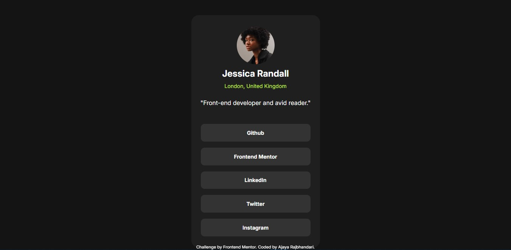

# Frontend Mentor - Social links profile solution

This is a solution to the [Social links profile challenge on Frontend Mentor](https://www.frontendmentor.io/challenges/social-links-profile-UG32l9m6dQ). Frontend Mentor challenges help you improve your coding skills by building realistic projects.

## Table of contents

- [Overview](#overview)
  - [The challenge](#the-challenge)
  - [Screenshot](#screenshot)
  - [Links](#links)
- [My process](#my-process)
  - [Built with](#built-with)
  - [What I learned](#what-i-learned)
  - [Continued development](#continued-development)
  - [Useful resources](#useful-resources)
- [Author](#author)
- [Acknowledgments](#acknowledgments)

## Overview

This project is a simple social links profile page built using HTML and CSS. The page displays a profile picture, name, address, and a brief description of the person. It also includes links to various social media platforms.

### The challenge

-One challenge was to create a responsive design that works well on different devices and screen sizes. The solution was to use flexbox layout and media queries to adjust the layout and styles based on the screen size.

-Another challenge was to create a smooth hover effect on the social media links. The solution was to use CSS transitions to create a smooth transition between the normal and hover states.

### Screenshot

### Links

- Solution URL: [Add solution URL here](https://github.com/Ajaya-Rajbhandari/SocialLinkProfile)
- Live Site URL: [Add live site URL here](https://your-live-site-url.com)

## My process

### Built with

- Semantic HTML5 markup
- CSS custom properties
- Flexbox
- CSS Grid

### What I learned

### Continued development

Use JavaScript to create a hover effect on the profile or to animate the social media links.

### Useful resources

--Used [BlackBox Ai]

## Author

- Website - [Ajaya Rajbhandari](https://www.your-site.com)
- Frontend Mentor - [@Ajaya-Rajbhandari](https://www.frontendmentor.io/profile/Ajaya-Rajbhandari)
- Twitter - [@yourusername](https://www.twitter.com/@Ajaya122)

## Acknowledgments

Little Help from BlackBox Ai.
Thank you for the opportunity to work on this project. I learned a lot and had fun building it
